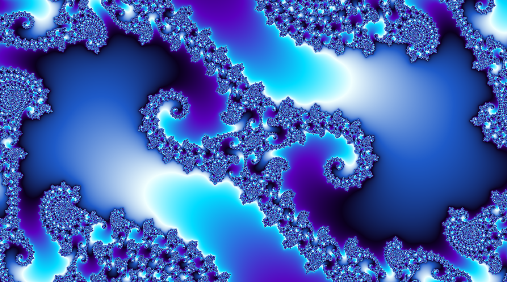
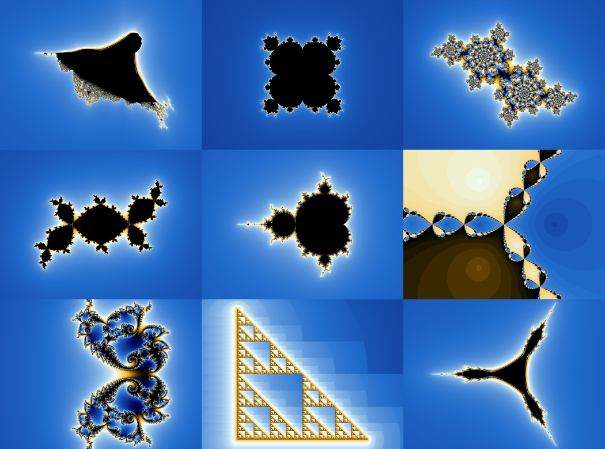
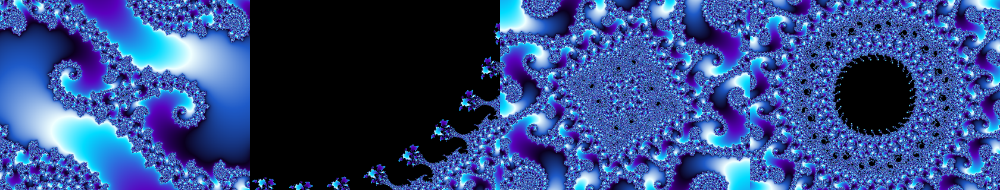
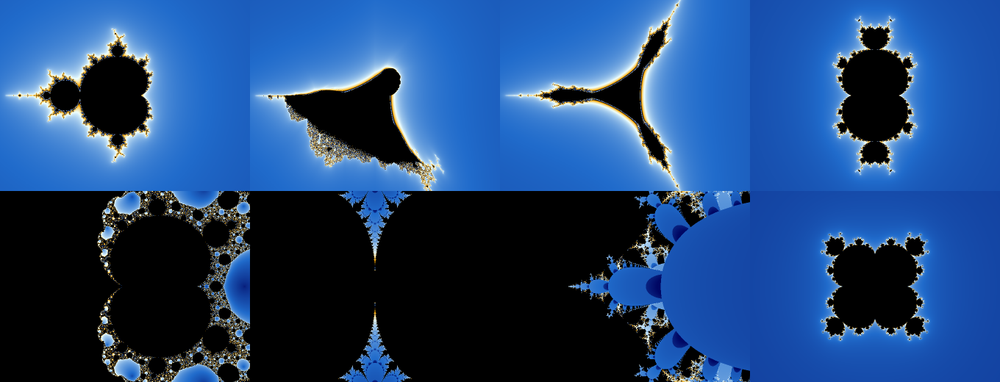
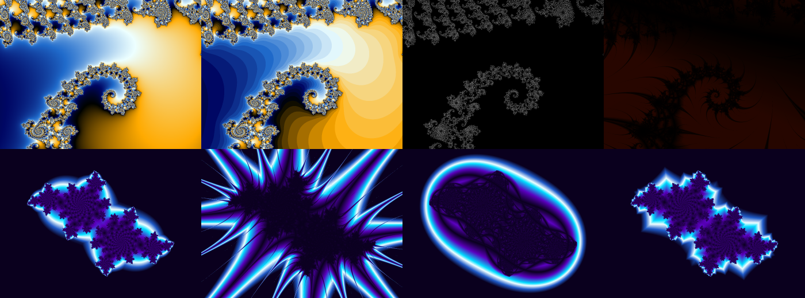
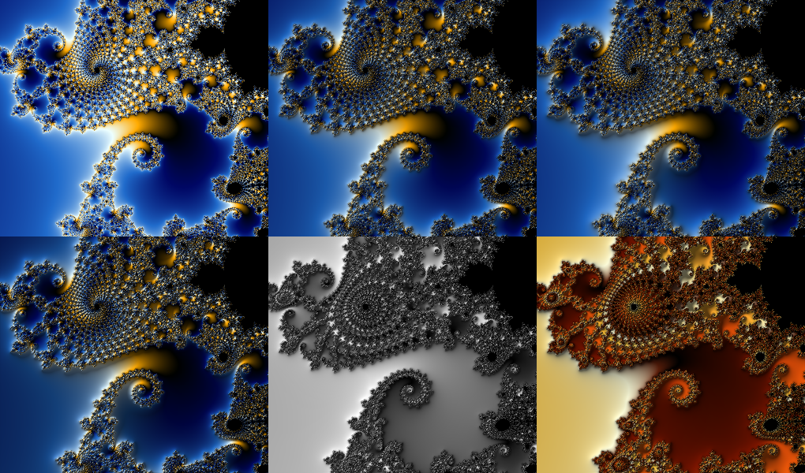
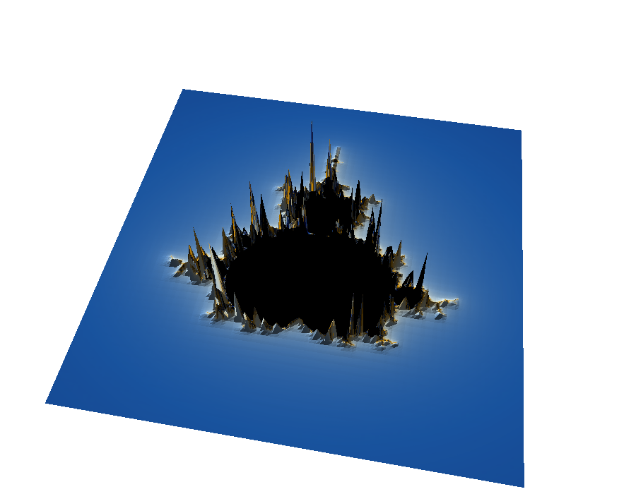
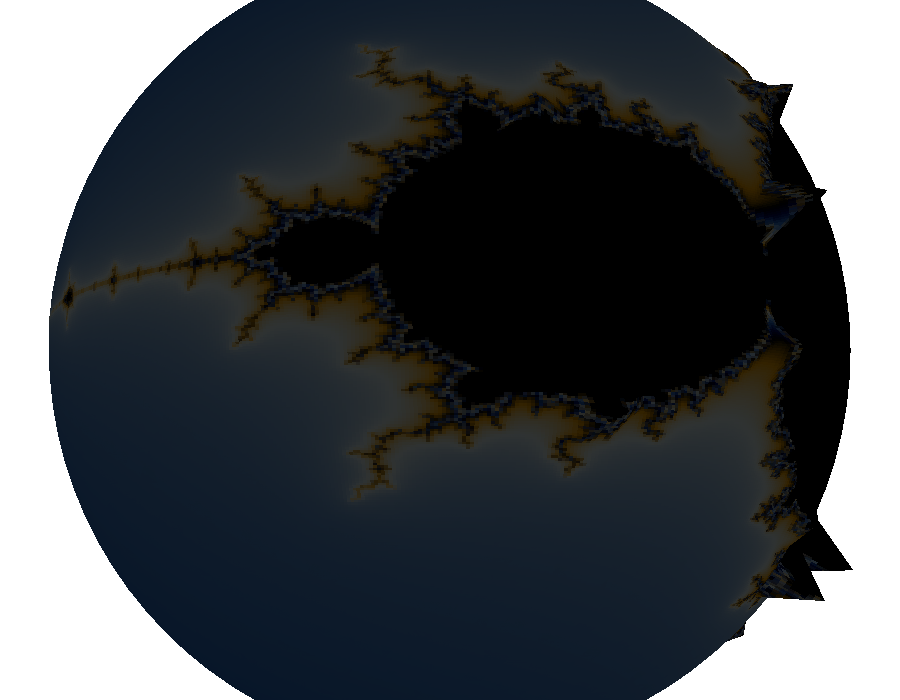

# GoFract

A fractal explorer in the spirit of **WinFract** / **Fractint**, written in Go
on top of [Ebitengine](https://ebitengine.org).

Not a toy: escape-time rendering on all cores, progressive refinement so the
window is never blank, a zoom history, smooth (band-free) colouring, and
high-resolution PNG export.



*Seahorse valley at ~10⁹ magnification: 8000 iterations, 2×2 supersampling,
smooth colouring.*

**Status: Phase 3.** Unlimited zoom depth by perturbation, a formula language,
relief lighting, and everything from Phases 1 and 2. See [Roadmap](#roadmap).



*Burning Ship, Custom (`z^5 + c`), Julia; Lambda, Mandelbrot, Newton;
Phoenix, Sierpinski, Tricorn — each at its own default view.*

---

## Build and run

Go 1.25 or newer (Ebitengine and `x/image` set the floor).

```sh
go build -o gofract .
./gofract
```

Or straight from source:

```sh
go run .
```

Ebitengine needs a GPU context and, on Linux, the usual X11/Wayland
development headers — see [Ebitengine's install
notes](https://ebitengine.org/en/documents/install.html). macOS and Windows
need nothing beyond the Go toolchain.

### Command line

| Flag | Default | Meaning |
| --- | --- | --- |
| `-w`, `-h` | `1280`, `800` | initial window size |
| `-hidpi` | `true` | render at the display's native pixel density (crisper, 4× the work on a Retina screen) |
| `-load FILE` | – | open a parameter file at start-up |
| `-params FILE` | `gofract.json` | file used by save/load parameters |
| `-fullscreen` | `false` | start full screen |
| `-vsync` | `true` | synchronise presentation to the display refresh |

---

## Controls

### Mouse

| Gesture | Action |
| --- | --- |
| **drag** left button | zoom marquee, locked to the window aspect; release to zoom |
| **click** left button | zoom ×2 about the clicked point |
| **wheel** | continuous zoom, anchored at the cursor |
| **drag** middle button | pan |
| **right click** | switch Mandelbrot ↔ Julia, freezing the clicked point as *c* |

A whole wheel burst or drag counts as **one** history step, so `Backspace`
returns to where the gesture started rather than unwinding it notch by notch.

**In a 3D view** (`4`), the mouse instead controls the camera: drag to orbit,
wheel to dolly in or out. There is no 2D point under the cursor to zoom into or
pick a Julia constant from once the screen shows a projection rather than the
plane itself, so the marquee, click-zoom and right-click Julia switch are all
inactive there — only the camera moves.

### Keyboard

Fractint-flavoured where it still makes sense.

| Key | Action |
| --- | --- |
| `T` / `Shift+T` | next / previous fractal type |
| `J` | Mandelbrot ↔ Julia at the cursor |
| `+` / `-` | double / halve the iteration ceiling |
| `[` / `]` | halve / double the bailout radius |
| `V` / `Shift+V` | next / previous colouring mode |
| `3` | toggle relief lighting |
| `4` / `Shift+4` | cycle 3D view: off → landscape → globe |
| `O` / `Shift+O` | next / previous orbit-trap shape |
| `C` / `Shift+C` | next / previous palette |
| `,` / `.` | rotate the palette |
| `A` | start/stop colour cycling |
| `<` / `>` | cycling slower / faster |
| `L` | toggle logarithmic mapping |
| `G` | toggle solid guessing |
| `R` | cycle supersampling (1× → 2×2 → 3×3) |
| `H`, `Home` | reset the view |
| `Backspace` / `Shift+Backspace` | history back / forward |
| arrow keys | pan |
| `S` | export PNG |
| `Ctrl+S` / `Ctrl+O` | save / load parameters |
| `Tab`, `X` | show/hide the options panel |
| `I` | show/hide the status readout |
| `F`, `F11` | full screen |
| `Esc` | cancel the marquee, or leave full screen |
| `Ctrl+Q` | quit |

### Drag and drop

Drop a Fractint **`.map`** file on the window to load it as the palette, or a
**`.json`** parameter file to restore a whole view. Ebitengine has no native
file dialog and writing one per platform would dwarf what it enables, so this
is the file picker.

Exported images land in the working directory as
`gofract-YYYYMMDD-HHMMSS.png`, at 1×–8× the window size (chosen in the panel).
The export runs on its own goroutine, so the explorer stays live while an 8×
image renders.

---

## Formulas

| Type | Iteration | Notes |
| --- | --- | --- |
| **Mandelbrot** | z → z² + c, z₀ = 0 | the parameter plane |
| **Julia** | z → z² + c, c fixed | right-click the Mandelbrot to pick c |
| **Burning Ship** | z → (\|Re z\| + i\|Im z\|)² + c | the absolute values break the symmetry about the real axis |
| **Tricorn** | z → conj(z)² + c | conjugating turns one cusp into three |
| **Newton** | z → z − (zⁿ−1)/(n zⁿ⁻¹) | converges rather than escapes; coloured by which root won |
| **Phoenix** | z → z² + p + q·z(n−1) | second order: the only formula that remembers where it came from |
| **Lambda** | z → λz(1−z) | the complex logistic map |
| **Sierpinski** | z → 2z, then fold | the gasket as an escape-time fractal |
| **Custom** | whatever you type | see [Formula language](#formula-language) |

Two of the classic parameter choices needed correcting to be worth looking at.
Fractint's stock Lambda constant λ = 0.85 + 0.6i maps (through the conjugacy
c = λ/2 − λ²/4) to c = 0.334 + 0.045i, which is *outside* the Mandelbrot set —
so that set is a dust with no interior at all. The default here is the λ that
maps to the centre of the period-3 bulb, giving the Douady rabbit. And the
Phoenix feedback term has to start at the pixel, not at zero: starting it at
zero breaks the figure into two disconnected clusters instead of the single
winged form.

## Zooming past float64



*The same point at 10⁹, 10¹⁵, 10²¹ and 10²⁷ magnification.*

A `float64` carries about 15 significant digits, so somewhere around 10¹⁵
magnification neighbouring pixels round to the same coordinate and the image
breaks into flat blocks. Past that point GoFract switches automatically to
**perturbation**.

The idea rests on one asymmetry. Precision is needed for *where the image is*,
never for *how big it is*: a pixel's offset from the centre of the view spans at
most the width of the picture, so it stays comfortably inside a `float64` however
deep the zoom. Only the centre needs to grow. So one reference point is iterated
in arbitrary precision — once per image, not once per pixel — and every pixel
then iterates its small difference from that reference:

```
z = Z + δz,   δz_{n+1} = 2·Z_n·δz_n + δz_n² + δc
```

The reference orbit is stored as plain `float64`, because its values are order 1
whatever precision the coordinate needed. The centre's precision is set from the
zoom level (`log₂(1/scale)` plus a guard), so at shallow zoom the machinery sits
idle at 64 bits and costs nothing.

**Glitches, and rebasing.** The classic failure of perturbation is that when δz
grows to the size of Z, the sum Z + δz cancels away its own significant digits
and a blob of visibly wrong pixels appears. GoFract uses *rebasing*: when |z|
falls below |δz|, the reference index is reset to 0 and δz is set to the full
value z. Since Z₀ = 0 for this family, Z₀ + z is exactly z — the substitution is
not an approximation, and the iteration count carries straight on. One reference
serves the whole image, with no glitch detection and no secondary references.

That Z₀ = 0 requirement is also why **only the Mandelbrot type takes this path**.
A Julia set's reference orbit starts at the pixel, not at zero, so there is
nothing to rebase onto. Other formulas keep iterating in `float64` and pixelate
past 10¹⁵; the status readout says so rather than pretending otherwise.

**What is not here:** series approximation and bivariate linear approximation.
Those skip iterations wholesale and are what make commercial deep-zoom renderers
fast at 10¹⁰⁰⁰; rebasing alone makes GoFract *correct* at any depth, but every
pixel still pays for every iteration. A 420×320 frame at 10²⁷ with a
20 000-iteration ceiling takes about 45 seconds here. The zoom ceiling from the
scale field itself is around 10³⁰⁰, where `float64` runs out of exponent.

## Formula language



*All eight typed as text: `z*z + c`, `sqr(abs(z)) + c`, `sqr(conj(z)) + c`,
`z^3 + c`, the Magnet formula, `sin(z) * p1`, `exp(z) + c`, `z^5 + c`.*

The **Custom** type is defined by two expressions you type — one for the starting
value, one for the step:

```
z0 =  0
z  ->  z*z + c
```

The notation follows Fractint's `.frm` dialect, because that is what decades of
published formulas are written in.

| | |
| --- | --- |
| values | `z` `c` (or `pixel`) `p1` `p2` `n` `i` `pi` `e`, and numbers |
| operators | `+` `-` `*` `/` `^`, unary `-`, brackets |
| functions | `sin` `cos` `tan` `sinh` `cosh` `tanh` `exp` `log` `sqrt` `sqr` `cube` `recip` `abs` `cabs` `conj` `real` `imag` `flip` `ident` |

`abs` is component-wise — `|Re z| + i·|Im z|`, the fold that gives the Burning
Ship its rigging — and `cabs` is the modulus, as in Fractint. `p1` and `p2` are
complex parameters wired to the sliders.

Expressions compile to a flat instruction list over a fixed stack, not a tree of
closures: the evaluator runs once per iteration per pixel, so it has to be free
of allocation and pointer chasing. It measures about 32 M iterations/second
against 162 M for the compiled-in Mandelbrot kernel — a typed formula costs
roughly 5× a built-in one, which is the ordinary price of interpretation and the
same trade Fractint made.

One detail worth calling out: smooth colouring needs to know the formula's
exponent, and a typed expression does not announce one. Rather than assume z²,
GoFract *measures* it — an escaping orbit satisfies |zₙ| ≈ |zₙ₋₁|^p, so the ratio
of consecutive log-moduli is the exponent. `z^5 + c` comes out band-free without
being told anything.

## Colouring



*Top: the four modes on one view — smooth, iteration, distance estimate, orbit
trap. Bottom: the four trap shapes — point, cross, circle, square.*

- **smooth** — the renormalised escape count. The default; no banding.
- **iteration** — the raw integer count, giving the hard concentric bands of
  classic Fractint output.
- **distance estimate** — how far the pixel is from the set boundary, which
  draws the boundary as a crisp line whose width in pixels does not change as
  you zoom. Needs a derivative, so it is offered only for the formulas that
  have one; Burning Ship and Tricorn fold the plane and Newton converges, so
  none of the three is complex-differentiable and the mode is hidden for them.
- **orbit trap** — the orbit's closest approach to a shape. Where escape time
  only records how long a point took to leave, a trap exposes the shape of the
  orbit itself, so trap images show structure in regions escape time paints
  flat.

Palettes are cyclic gradients, so a continuously rising value sweeps the ramp
over and over with no seam — which is what makes both smooth colouring and
colour cycling look right. Eight presets ship; the editor forks any of them
into an editable set of control points, and Fractint `.map` files load by drag
and drop.

**Relief lighting** (`3`) treats the colouring value as a height field and lights
it from a movable source, which is where the embossed look comes from. It is
applied during colouring, so it rides on the cached values: moving the light is
a re-colour, not a re-render.



*Unlit, then lit at increasing depth and a lower sun; then grayscale, which is
closest to what Fractint's 3D mode produced.*

This is the lighting half of Fractint's 3D mode, not the projection half: the
surface is shaded in place rather than rotated into perspective. Height comes
from the same value that picks the colour, measured in palette cycles so the
depth control means the same thing in every colouring mode, and points inside
the set are pinned to their neighbours' height so the silhouette does not read
as a cliff.

**Colour cycling** (`A`) animates the ramp rotation. It re-colours cached values
rather than re-rendering, so it costs a lookup-table pass and no iteration —
about 6 ms at 1080p. That is still a third of a frame budget, so the repaint is
throttled on large windows; the rotation advances on wall-clock time either way,
so only the animation's frame rate drops, never its speed.

## Solid guessing

Skipping a sample whose four enclosing neighbours already agree, on the
assumption that the sample between them agrees too. On an interior-heavy deep
zoom this is worth an order of magnitude, because the samples it skips are
exactly the expensive ones: a point that never escapes costs the full iteration
budget.

Measured on an 8-core M2, 480×360 at 4000 iterations in the seahorse valley:

| | time | samples skipped | pixels differing from exact |
| --- | --- | --- | --- |
| off | 518 ms | — | — |
| on | 43.6 ms | 75% | 0.37% |

It is an assumption, not a theorem: a filament thinner than a cell can thread
between four agreeing corners and be missed, which is where those few tenths of
a percent come from. Turn it off (`G`) when that matters — exports never use it,
since they are computed in a single pass with no coarse neighbours to consult.

This is deliberately a two-value setting rather than the graded off/safe/fast
Fractint offered, because measurement did not support a middle ground. A looser
tolerance — agreement in rendered colour rather than bit-for-bit — skipped only
about 2% more samples while multiplying the error by five. There was nothing
worth trading, so the option is not there.

---

## 3D views

Fractint's two "3D transform" modes, revived as a live view you rotate rather
than a one-shot render: press `4` (or pick it in the panel) to turn the flat
picture into a **landscape** or wrap it onto a **globe**.



*The escape-time boundary read as terrain: the black interior is the sea, and
the coastline's iteration counts become jagged coastal mountains — exactly as
spiky as Fractint's own fractal terrains were, because that spikiness is what
raw escape-time data looks like as a height field.*



*Wrapped onto a sphere instead, with a small outward bulge along the boundary
so the coastline reads as terrain on a planet rather than a flat decal.*

Both modes read the same **colouring values** the 2D view already computed —
not the pixels, the underlying escape/smooth/distance/trap numbers the
renderer caches for re-colouring — as an elevation grid, and drape the already
-rendered 2D image over the resulting mesh as a texture. A 3D view costs
nothing to switch into: there is no separate render, only a different way of
looking at the picture that exists already.

**Camera.** An orbit camera — Fractint's entire 3D control surface, revived:
rotate around the scene (drag, or the arrow keys), tilt the viewing angle,
dolly in or out (the wheel). It always looks at the centre of the scene, which
is what keeps "drag to rotate" from ever needing to worry about pointing the
camera the wrong way through the terrain. `Home` resets it; `4` / `Shift+4`
cycle Off → Landscape → Globe.

**Lighting** is the same azimuth/elevation the 2D relief-lighting sliders
control (Color section) — one sun position for both views, so there is only
one pair of sliders to reason about, not two.

**Why the landscape needs sorting and the globe does not.** Both meshes are
flat-shaded, projected triangles, drawn back-to-front (the painter's
algorithm) with no per-pixel depth buffer. For the landscape that ordering is
load-bearing: a heightfield can and does have hills hiding valleys behind them
from an oblique camera. For the globe it is almost redundant — once triangles
facing away from the camera are culled, a convex surface's remaining facets
cannot occlude one another by construction, so *any* order of what survives
culling is already correct. The code still sorts both, for one uncomplicated
code path rather than two, but only the landscape actually depends on it —
which `TestGlobeFacesOutward` and `TestLandscapeSortedBackToFront` check
separately, for exactly that reason.

**Performance.** Rebuilding the mesh — projecting every vertex, shading every
triangle, sorting the whole thing back-to-front — is real work: about 8 ms for
a 150×110 landscape at 1280×800 (`BenchmarkBuildLandscape`), roughly half a
frame's budget. It only happens when the camera or the underlying picture
actually changes, not on every `Draw` call, so an idle 3D view costs nothing;
dragging to rotate pays that cost every frame it moves. Sorting triangles by
depth is the expensive half of that number — sorting a slice of lightweight
indices instead of the 128-byte triangle records directly, then reordering
once at the end, measured at roughly half the cost of sorting the records in
place.

Ebitengine's `DrawTriangles` indexes with `uint16`, capping a single call at
65 535 vertices; a landscape mesh runs well past that, so the mesh is drawn in
a handful of batches rather than one call. This is transparent — batch
boundaries are chosen on triangle boundaries, so a triangle is never split
across two draw calls — and costs nothing worth measuring.

---

## How it works

### Escape time, and why the colours are smooth

Each pixel is a point of the complex plane, iterated under the formula until
it leaves a bailout circle. The raw iteration count is an integer, which
paints the visible concentric *bands* that make naive fractal images look
cheap. GoFract instead stores the **renormalised** count

```
mu = n + 1 - log_p( ln|z| / ln(bailout) )
```

which interpolates across the overshoot of the final step: a point that
barely crossed the circle scores ≈ *n*+1, one that overshot by a full power of
*p* scores ≈ *n*. The result varies continuously across the image, so the
gradient is genuinely smooth (`M` toggles back to integer counts if you want
the classic banding).

Two shortcuts keep the interior cheap. The main cardioid and the period-2
bulb are known in closed form and are tested directly. Beyond them, orbits
that fall onto an attracting cycle are caught by **periodicity detection**,
which compares the orbit against a reference point refreshed on an
exponentially growing schedule. Its tolerance is deliberately tight — a false
positive paints a solid blob where detail belongs, which is a far worse defect
than the lost speed.

### Progressive rendering

A render is a sequence of passes at sample strides 16, 8, 4, 2, 1. Each pass
computes only the lattice points the previous ones skipped and paints each
result across its stride × stride block, so the image is *complete* — if
chunky — after the first pass, then sharpens. Nothing blocks the event loop:
passes run on a worker pool and publish as they land.

While a gesture is in flight, the last completed frame is **reprojected** by
an affine transform matching the new view, so panning and wheel-zooming feel
continuous instead of flashing black between renders.

### Escape counts are cached, not just pixels

The renderer keeps the finished float32 escape-count grid. Changing a palette,
rotating the ramp or adjusting the density is therefore a lookup-table pass
over cached data with **no iteration at all** — which is also what makes
colour cycling cheap to add.

### Concurrency

One job runs at a time. Starting a new one raises a cancellation flag and
bumps a sequence number; workers notice between rows, and any result from a
superseded job is dropped at publish time. `Start` deliberately does *not*
wait for the outgoing workers to drain — blocking the event loop on that would
stutter panning.

---

## Project layout

```
main.go               flags, window setup
internal/
  formula/            the expression language: lexer, parser, stack machine
  fractal/            pure mathematics — one file per formula, no rendering;
                      plus the perturbation path for deep zoom
  renderer/           worker pool, progressive passes, solid guessing,
                      shallow/deep sampling, colour mapping, relief lighting,
                      the height grid the 3D views read
  view3d/             orbit camera, landscape/globe mesh projection — plain
                      math, no graphics-library dependency
  palette/            cyclic colour ramps, presets, Fractint .map parser
  params/             the serialisable state: arbitrary-precision view,
                      formula, colouring, history
  ui/                 a small immediate-mode widget layer
  app/                the Ebitengine game: input, panel, HUD, palette editing,
                      the 3D view's camera state and DrawTriangles glue
```

### Adding a fractal type

Implement `fractal.Fractal` and register it. Nothing else needs to change —
the type appears in the panel, and its `Params()` descriptors become sliders
automatically.

```go
func init() { Register(BurningShip{}) }

type BurningShip struct{}

func (BurningShip) Name() string      { return "Burning Ship" }
func (BurningShip) Companion() string { return "" }
func (BurningShip) Params() []Param   { return nil }
func (BurningShip) HasDeriv() bool    { return false } // not analytic

func (BurningShip) Defaults() Defaults {
        return Defaults{CX: -0.5, CY: -0.5, Width: 3.4, MaxIter: 256, Bailout: 256, Density: 8}
}

func (BurningShip) Iterate(cr, ci float64, o *Options) Result {
        t := track(o) // shared periodicity detection and orbit-trap bookkeeping
        var zr, zi, zr2, zi2 float64
        for n := 0; n < o.MaxIter; n++ {
                if zr2+zi2 > o.Bailout2 {
                        return t.escaped(n, zr2+zi2, math.Ln2, 0, 0, o)
                }
                zi = 2*math.Abs(zr*zi) + ci
                zr = zr2 - zi2 + cr
                zr2, zi2 = zr*zr, zi*zi
                if t.step(zr, zi) {
                        return t.interior()
                }
        }
        return t.interior()
}
```

`Defaults` is how a formula asks for the presentation that suits it —
Sierpinski wants a tight bailout and a high colour density because its escape
counts only reach single digits, Newton wants a density of 1 so one palette
sweep covers all its basins. Anything left at zero means "no preference", and
the user's current value survives the switch.

---

## Performance

`Iterate` is dispatched through an interface once per *sample*, never per
iteration, so the abstraction costs nothing measurable next to the inner loop.

Measured on an Apple M2 (8 cores), 800×600 Mandelbrot at the home view with a
256-iteration ceiling:

```
$ go test -bench BenchmarkMandelbrot ./internal/renderer/
BenchmarkMandelbrot-8   5   10754317 ns/op   44.63 Mpx/s
```

That is ~45 megapixels/second against a 1–2 Mpx/s target, plus whatever solid
guessing saves on top. Deep zooms cost more, because the iteration ceiling has
to rise with the magnification.

Phase 2 cost about 18% of the Phase 1 figure (54 → 45 Mpx/s). Moving
periodicity detection and orbit-trap accumulation into one shared helper, and
adding the branch that skips derivative work when nothing needs it, put a
little more in the inner loop. That bought eight formulas that each only have
to write their own recurrence, and it is a trade worth making at 20× the
target — but it is a real cost, not a free abstraction.

`float64` runs out of precision at roughly 10¹⁵× magnification, at which point
the image visibly pixelates into blocks. Getting past that needs arbitrary
precision and perturbation — see below.

## Tests

```sh
go test ./...
go test -race ./...
```

The interesting ones are properties rather than golden files:

- with guessing off, the progressive render must be **byte-identical** to a
  direct single-pass render, which is what proves no coarse block is left
  behind; with guessing on, the divergence is measured and bounded;
- a Julia set contains 0 exactly when its *c* is in the Mandelbrot set, giving
  the two kernels an independent check on each other;
- iterating without the cardioid/bulb shortcuts is an oracle for iterating
  with them, over ~34 000 points — this is what guards the periodicity
  tolerance against false positives;
- the smooth escape count must be monotone along a ray and free of jumps at
  band boundaries;
- every registered formula must produce an actual picture over its own default
  view — some of the set, some of its outside, and a gradient between. This is
  what caught the Lambda default: the arithmetic was right and the image was
  empty;
- Newton must converge *to a root of unity*, with every basin represented, and
  its three-fold symmetry holds exactly;
- the distance estimate is checked against the Koebe quarter theorem — a disc
  of a quarter the estimated radius must contain no point of the set — which
  validates the derivative through the thing it exists for rather than
  re-deriving the recurrence and comparing it against itself;
- `ZoomAt` must leave the world point under the cursor exactly where it was;
- rapid restarts (a pan gesture) must settle on the last request;
- **perturbation must agree with exact arithmetic.** Every sample over six
  different regimes is checked against an oracle that iterates entirely in
  arbitrary precision — 0 disagreements in 1350 points — and again at offsets
  of 1e-25, where the same patch through `float64` collapses to a single flat
  value;
- perturbation must be **reference-independent**: rendering the same points from
  two unrelated reference orbits must give the same answer, which is the sharpest
  available statement that rebasing leaves no glitches;
- typed formulas must reproduce the built-ins — `z*z + c`, `sqr(abs(z)) + c` and
  `sqr(conj(z)) + c` are checked against the compiled Mandelbrot, Burning Ship
  and Tricorn kernels;
- relief lighting may only attenuate, never brighten;
- an orbit camera's distance from the scene is invariant under yaw and pitch,
  and a point it looks straight at always projects to the exact centre of the
  viewport;
- a flat landscape lit from directly above is at uniform full brightness
  everywhere — the only way a shading bug could hide would be for every facet
  to happen to compute the same wrong answer;
- **globe culling keeps the right hemisphere.** It would be easy to get the
  winding-fix-up sign backwards and end up drawing the far side of the sphere
  instead of the near one, so `TestGlobeFacesOutward` checks for geometry at
  the point on screen the camera is looking straight at, not merely that
  *some* triangles survived culling;
- back-to-front order is checked directly against the sort key, not inferred
  from how the image looks.

Two things are worth saying about the deep-zoom tests, because getting them
wrong is easy and quiet. The oracle is high-precision arithmetic, not a
`float64` render: rounding a 200-bit reference coordinate to `float64` moves it
by ~1e-17, and a point 1400 iterations from escaping is sensitive enough that
such a move shifts its escape count by dozens — comparing against `float64`
would be comparing answers to different questions. And the deep coordinates are
*derived* by bisection in the test rather than pasted in from a screenshot, so
they can be checked rather than trusted.

One test is deliberately loose. The distance estimate runs about five times
small a hair from the cusp at c = ¼, because that is a parabolic point where the
orbit lingers near the fixed point for ~π/√d iterations and the derivative piles
up over all of them. That is a known limit of the estimator, not a defect here,
so only the ordering is asserted there and the reason is written down next to
it.

## Roadmap

**Phase 1 — done.** Mandelbrot and Julia; marquee, click, wheel and drag
navigation; eight palettes with smooth colouring; iteration and bailout
controls; supersampling; zoom history; parameter save/load; PNG export.

**Phase 2 — done.** Six more formulas (Burning Ship, Tricorn, Newton, Phoenix,
Lambda, Sierpinski); distance estimation and orbit traps; colour cycling; a
palette editor with `.map` import by drag and drop; solid guessing; a
collapsible, scrollable options panel.

**Phase 3 — done.** Arbitrary-precision coordinates with perturbation and
rebasing, lifting the zoom limit past float64; a Fractint-style formula language
with its own compiler and stack machine; relief lighting of the value as a
height field; and — past what Phase 3 originally scoped — the real 3D
projection it had explicitly left undone: an orbit camera over a landscape or a
globe, with rotation and perspective rather than in-place shading.

**Not done, and worth being explicit about:** series approximation and BLA,
which would make deep renders fast rather than merely correct; perturbation for
formulas other than Mandelbrot; and — in the 3D views — self-occlusion in the
landscape is a depth-sorted approximation, not a per-pixel depth buffer, so an
extreme overhang could in principle draw wrong (in practice, a heightfield
cannot fold back on itself, so this has no way to occur in the landscape mesh
itself; it is a caveat about the technique, not an observed defect).

## Licence

MIT.
